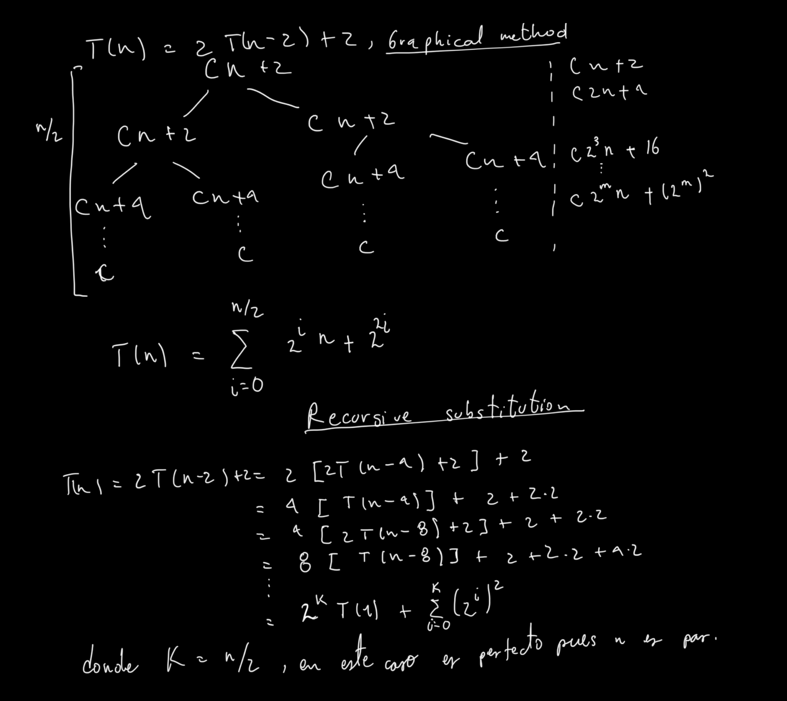

# Punto 1
## 1.2-2
si ponemos las ecuaciones en wolfram alpha nos damos cuenta de que la respuesta es 43.55, es decir que para numeros menores a 43 el polinomio  es mejor que  y de 44 en adelante el opuesto es cierto
## 1.2-3
De nuevo si usamos wolfram para evaluar la igualdad nos damos cuenta que 
el polinomio es mayor que la exponencial en el intervalo 
en el resto de numeros naturales la exponencial es mayor al polinomio.
## 3-1 
a) Evidentemente es lo mismo a probar 

 0">

lo cual es obvio pues podemos multiplicar numerador y denominador por 
  y hacer las fracciones de tipo  tender a cero. 

b) Evidentemente es lo mismo a probar

lo cual es obvio pues podemos multiplicar numerador y denominador por 
  y hacer las fracciones de tipo  tender a cero.  

c) basta usar el teorema 3-1 y los resultados a) b).

d) Evidentemente es lo mismo a probar

lo cual es obvio pues podemos multiplicar numerador y denominador por 
  y hacer las fracciones de tipo  tender a cero.

e) Evidentemente es lo mismo a probar

lo cual es obvio pues podemos multiplicar numerador y denominador por 
  y hacer las fracciones de tipo  tender a cero.

# Punto 2
## 0.1
| f = O(g) | f = Omega(g) | label |
|----------|--------------|-------|
| YES      | YES          | a     |
| YES      | NO           | b     |
| YES      | NO           | c     |
| YES      | YES          | d     |
| YES      | YES          | e     |
| NO       |  YES         | f     |
| NO       |YES           | g     |
| YES      |   NO         | h     |
|  YES     |  YES         | i     |
|   NO     |  YES         | j     |
|   YES    |  NO          | k     |
|   NO     | YES          | l     |
|    NO    |  YES         | m     |
|    NO    |  YES         | n     |

## 0.2
a) en este caso  cuando n tiene a infinito es facil ver que tiende a el inverso multiplicativo de (1-c) que es una constante. por tanto en notación theta mayuscula puede
limitarse a una mayuscula.

b) evidentemente g(n) = n por tanto es igual a si misma en notacion theta mayuscula.

c) Podemos usar limites en el numerador g(n) y en el denominador c elevado a la n. Si multiplicamos numerador y denominador por el inverso multiplicativo de c elevado a la n entonces el limite resulta constante como se quería demostrar.

# Punto 3

# Punto 4

